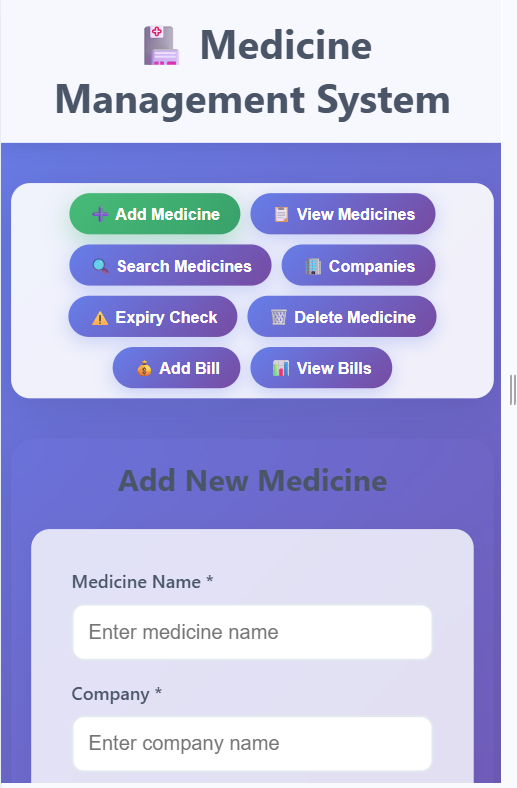

# Medicine Management System

A modern web application for managing medicines, billing, and inventory in a pharmacy or medical store.

---

## Features
- Add, view, search, and delete medicines
- Manage companies and expiry stock
- Create and view bills
- Add stock and update price for medicines
- Responsive, modern UI with modal dialogs for actions

---
| Add Medicine | View Medicines | Add Bill |
|--------------|----------------|----------|
|  |  |  |

| View Bills | Search Medicine | Expiry Stock |
|------------|--------------|--------------|
|  |  |  |

| Manage Companies | Mobile View |
|------------------|-----------|-------------|
|  |  |

---

## Getting Started

### Prerequisites
- Java 8+
- SBT (Scala Build Tool)
- MongoDB (running locally or remotely)

### Setup
1. **Clone the repository:**
   ```bash
   git clone https://github.com/yourusername/medicine-management-system.git
   cd medicine-management-system
   ```
2. **Configure MongoDB:**
   - Update your MongoDB connection string in `src/main/scala/services/MongoConnection.scala` if needed.
3. **Run the backend:**
   ```bash
   sbt run
   ```
   The server will start at [http://localhost:8000](http://localhost:8000)
4. **Open the app:**
   - Open `http://localhost:8000` in your browser.

---

## Usage
- Use the navigation tabs to add/view/search medicines, manage companies, check expiry stock, and handle bills.
- Use the action buttons in the View Medicines table to add stock or update price with a modern modal dialog.

---

## Project Structure
- `public/` - Frontend HTML, CSS, JS
- `src/main/scala/` - Scala backend (Akka HTTP, MongoDB)
- `src/main/scala/services/` - Service logic for medicines and bills
- `src/main/scala/models/` - Data models

---

## License
MIT 